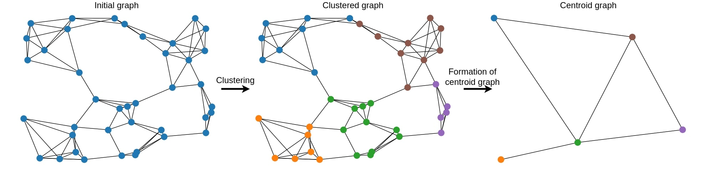
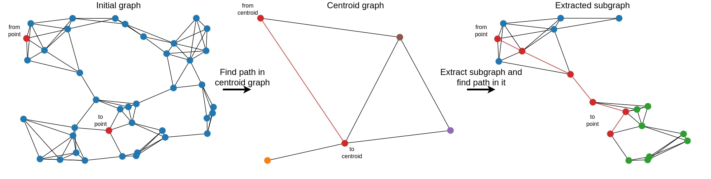
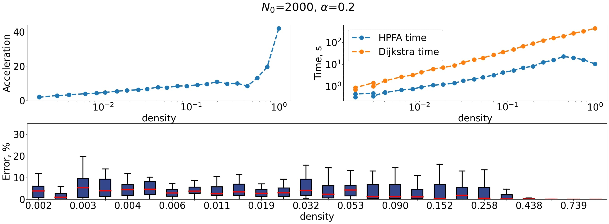
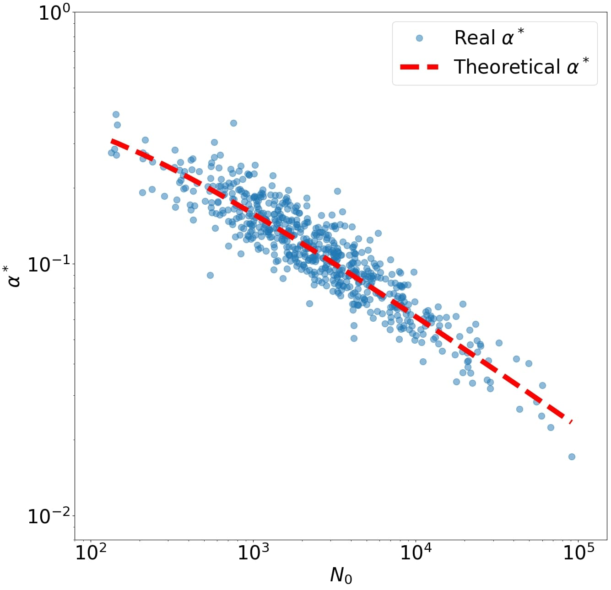
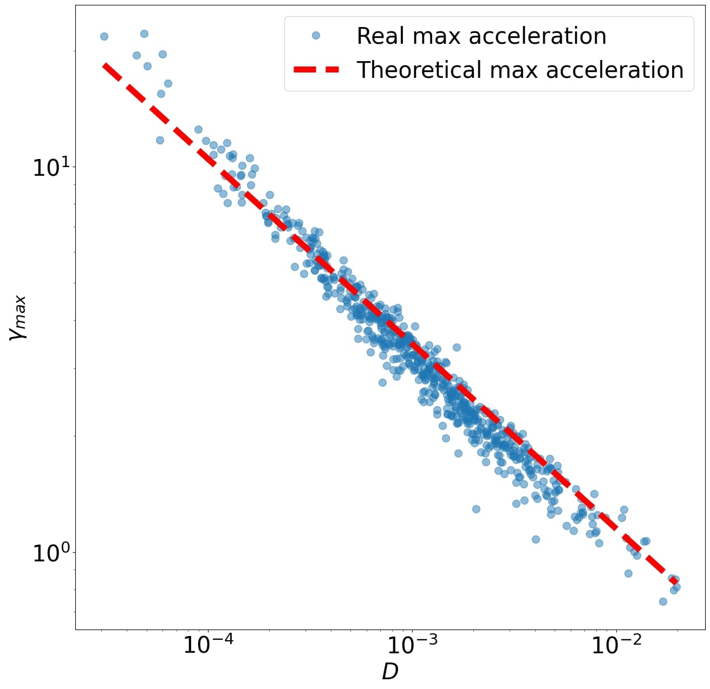

<!--

-->

# RIDE


**RIDE** (Rapid infra-cluster dijkstra enhancer) library

The RIDE is a python library for accelerating Deikstra task on any graphs with hierarchical method involving solving a problem on simpler graphs with further combining solutions into a common one. The method is based on the division of the graph into clusters. By using this division, you can eliminate many sub optimal route constructions and achieve multiple-time acceleration without significant loss of accuracy. More information about method ine can find soon in corresponding _article_.

***It is worth noting that this method works for both transport and abstract graphs.***
<!-- 

-->

# Installing

to install via pip without listing on pipy do: 
```
!pip install git+https://github.com/NikitaNikolaevich/graph-topology-in-routing-problems.git@main
```

# Quick start


```py
# Graph download

id = "44915"  # or 'R{id}'
graph = DataGetter.download_graph(id=id)

#Viewing the theoretical acceleration for a graph
#Visually select the “alpha” range for testing
N = graph.number_of_nodes()
plot_theoretical_acceleration(N, (16, 6))

#Graph testing
#The important thing here is to pick the “resolution” parameter. See logs.

cityResult = city_tests.test_graph(
    graph, f"{id}", id, logs=False, alg="dijkstra", alpha_range=(0.04, 0.1)
)

#Creating the object to be searched.
graphModel = graph_generator.generate_layer(graph, resolution=20)

#Final distance, path by node and map display (map optional)
point_from = 2791569568
point_to = 1666166594
distance, path, maps = graphModel.find_path(
    point_from, point_to, draw_path=True, visible=True
)
```


# How it works:
1. Creation of a new graph based on centers of initial graph clusters



2. Computation of shortes path on a new cluster-based graph (this contraction-hierarchy based approach is obviously faster hhan straight forward calcylation of shortest path, but less accurate)



3. Comparison of obtained metric for error-speedup trade-off



# Findings

The relationship between theoretical estimations and empirical cal-
culations. Figure 1,3 – the relationship between the maximum of acceleration γmax and the number of vertices N0 in the graph.
the relationship between the optimal value of the α∗parameter and the number of vertices N0. Figure 2 – the dependence of the maximum acceleration γmax on the graph density D (unscaled characteristic) along with the theoretical estimations, considering the equality given by D=2β0/N0.

Developed algorithm was applied for 600 cities and the following dependencies were obtained:

<div style="text-align: center;">
    
    
    
</div>

<!-- # Results

Explore the performance of the Hierarchical Pathfinding Algorithm compared to the classical Dijkstra algorithm through the following graphs: -->

<!--  -->

<!-- 
The relationship between the maximum acceleration $γ_{max}$ and the number of vertices $N_0$ in the graph.


-->

<!-- ## Contributing

We welcome contributions! Please read our [Contributing Guidelines](CONTRIBUTING.md) for more information. -->

## License

This project is licensed under the MIT License. See the [LICENSE](LICENSE) file for details.

## Acknowledgments

- [Dijkstra's Algorithm](https://en.wikipedia.org/wiki/Dijkstra%27s_algorithm)
- [Open Street Maps](https://www.openstreetmap.org)

---

For more information, check out our [documentation](https://graph-topology-in-routing-problems.readthedocs.io/en/latest/).
