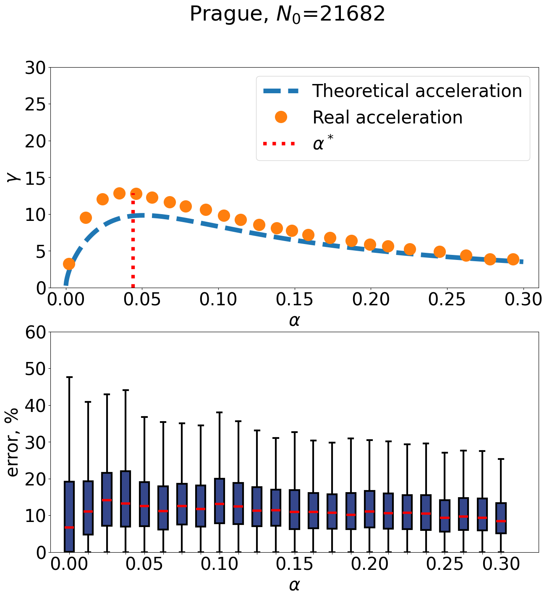
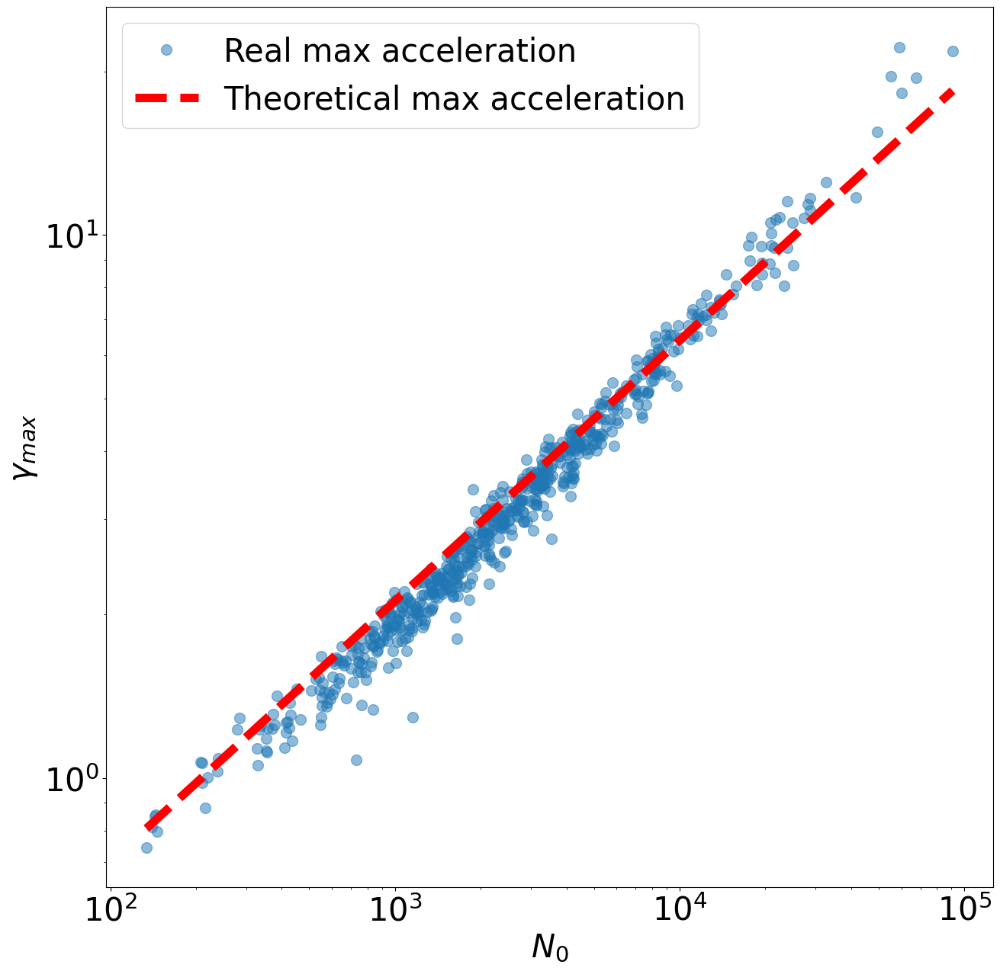

<!--

-->

# RIDE
[](https://www.repostatus.org/#active)
[](https://pypi.org/project/scikit-learn/)
[](https://graph-topology-in-routing-problems.readthedocs.io/en/latest/?badge=latest)


**RIDE** (Rapid infra-cluster dijkstra enhancer) library

The RIDE is a python library for accelerating Deikstra task on any graphs with hierarchical method involving solving a problem on simpler graphs with further combining solutions into a common one. The method is based on the division of the graph into clusters. By using this division, you can eliminate many sub optimal route constructions and achieve multiple-time acceleration without significant loss of accuracy. More information about method ine can find soon in corresponding _article_.
<!-- 

-->

# Installing

to install via pip without listing on pipy do: 
```
!pip install git+https://github.com/NikitaNikolaevich/graph-topology-in-routing-problems.git@main
```

# Quick start

First, you need to choose a graph for a quick start. You can create or download one yourself, or use the function to download a graph from Open Street Maps by city id.


```
#example city_id (44915) for Prague, Czechia
#see more on osn webpage: https://www.openstreetmap.org/relation/435514

G = DataGetter.download_graph(id="R435514")
```


It is worth noting that this method works for both transport and abstract graphs.

# Results

Explore the performance of the Hierarchical Pathfinding Algorithm compared to the classical Dijkstra algorithm through the following graphs:



<!-- 
The relationship between the maximum acceleration $γ_{max}$ and the number of vertices $N_0$ in the graph.


-->

## Contributing

We welcome contributions! Please read our [Contributing Guidelines](CONTRIBUTING.md) for more information.

## License

This project is licensed under the MIT License. See the [LICENSE](LICENSE) file for details.

## Acknowledgments

- [Dijkstra's Algorithm](https://en.wikipedia.org/wiki/Dijkstra%27s_algorithm)
- [Open Street Maps](https://www.openstreetmap.org)

---

For more information, check out our [documentation](https://graph-topology-in-routing-problems.readthedocs.io/en/latest/).